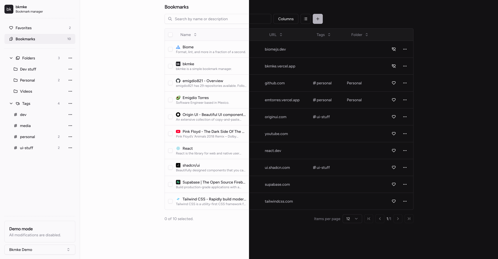

[bkmke](https://bkmke.vercel.app/) is an open-source simple bookmark manager.

#### Tech stack

- [Tailwind](https://tailwindcss.com/) - CSS styling.
- [shadcn/ui](https://ui.shadcn.com/) - UI React components.
- [Next.js](https://nextjs.org/) - React framework.
- [Supabase](https://supabase.com/) - Auth and database.
- [Vercel](https://vercel.com/) - Hosting.

#### Preview

